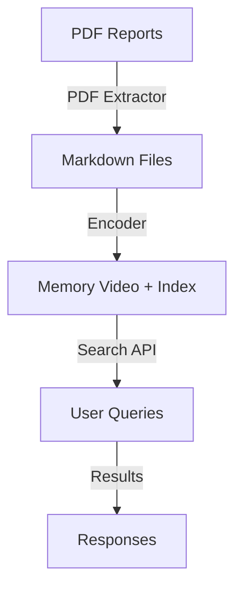

# MemVid DGCA Aircrash AI

A comprehensive multi-modal AI system for analyzing and understanding aviation accident reports and related video content from the Directorate General of Civil Aviation (DGCA), India. This project combines advanced NLP techniques with video understanding to provide deep insights into aviation safety incidents.

## About DGCA Accident Reports

The Directorate General of Civil Aviation (DGCA) is the regulatory body for civil aviation in India. The DGCA maintains a comprehensive database of aviation accident and incident reports, which are crucial for improving aviation safety.

### Data Source
- **Official Website**: [DGCA DigiGov Portal](https://www.dgca.gov.in/digigov-portal/)
- **Accident Reports Section**: [View Accident Reports](https://www.dgca.gov.in/digigov-portal/?dynamicPage=AccidentReports/500005/0/viewApplicationDtlsReq)

### Dataset Details
This repository contains the 15 most recent aviation accident reports from the DGCA database. These reports include:
- Detailed investigation findings
- Analysis of contributing factors
- Safety recommendations
- Statistical data on aviation accidents
- Technical details of the incidents

### Report Contents
Each accident report typically includes:
1. **Executive Summary**
2. **Factual Information**
   - History of the flight
   - Injuries to persons
   - Damage to aircraft
   - Other damage
3. **Analysis**
   - Weather conditions
   - Human factors
   - Technical factors
   - Organizational factors
4. **Findings**
5. **Safety Recommendations**

## Features

- **Document Analysis**: Process and understand complex aviation accident reports
- **Video Understanding**: Analyze and reason about aviation safety videos
- **Multi-modal Integration**: Combine insights from both text and video data
- **Memory-Augmented Retrieval**: Advanced context understanding using memory mechanisms

## Getting Started

### Prerequisites

- Python 3.8+
- pip (Python package manager)
- Git

### Installation

1. Clone the repository:
   ```bash
   git clone https://github.com/yourusername/memvid-dgca-aircrash-ai.git
   cd memvid-dgca-aircrash-ai
   ```

2. Create and activate a virtual environment:
   ```bash
   python -m venv venv
   source venv/bin/activate  # On Windows use `venv\Scripts\activate`
   ```

3. Install the required packages:
   ```bash
   pip install -r requirements.txt
   ```

## Usage

### Basic Usage

```python
from memvid_ai import MemVidAI

# Initialize the AI system
ai = MemVidAI()

# Process a document
analysis = ai.analyze_document("path/to/accident_report.pdf")

# Process a video
video_analysis = ai.analyze_video("path/to/accident_video.mp4")
```

## Encoding Markdown Reports

Use the provided `data_processing/encoder.py` script to encode extracted Markdown accident reports into a MemVid memory video and searchable index.

Example:

```bash
python data_processing/encoder.py --input-dir data/accident-reports-15-markdown --output-dir data/current
```

This process:
- Reads all `.md` files under `data/accident-reports-15-markdown`
- Configures MemvidEncoder with `chunk_size=2048`, `overlap=64`, and `IVF` index type
- Generates a memory video (e.g., `encoded_memory.mp4` or `.mkv`)
- Writes `encoded_memory_index.json` and `encoded_memory_index.faiss` in the output directory
## Project Structure

```
memvid-dgca-aircrash-ai/
├── data/                  # Data files
│   └── dgca_reports/      # DGCA accident reports (PDFs)
│       ├── report_1.pdf
│       ├── report_2.pdf
│       └── ...
├── docs/                  # Documentation
│   └── dgca_reports/      # Processed report data
│       ├── summaries/
│       └── analysis/
├── memvid_ai/             # Main package
│   ├── __init__.py
│   ├── document_processor.py
│   ├── video_analyzer.py
│   ├── dgca_parser.py     # DGCA specific report parsing
│   └── utils.py
├── tests/                 # Test files
├── .gitignore
├── LICENSE
├── README.md
└── requirements.txt
```

## Architecture

### System Overview

The application follows a pipeline architecture with the following key components:



### Detailed Workflow

1. **PDF Processing Phase**
   - `data_processing/pdf_extractor.py` processes PDF documents
   - Converts both searchable and scanned PDFs to markdown format
   - Preserves document structure and metadata
   - Outputs clean, structured markdown files

2. **Encoding Phase**
   - `data_processing/encoder.py` processes the markdown files
   - Encodes text content into a memory-efficient video format
   - Generates two index files:
     - `encoded_memory_index.json`: Contains metadata and chunk information
     - `encoded_memory_index.faiss`: FAISS index for efficient similarity search

3. **Search Phase**
   - `server/search.py` handles search functionality
   - `server/app.py` provides a FastAPI-based REST API
   - Queries are processed using the encoded video and FAISS index
   - Supports multiple LLM providers (OpenAI by default)

### Data Flow

1. **Input**: PDF documents are placed in the `data/dgca_reports/` directory
2. **Processing**:
   ```bash
   # Convert PDFs to markdown
   python -m data_processing.pdf_extractor data/dgca_reports -o data/processed_markdown
   
   # Encode markdown to memory format
   python data_processing/encoder.py --input-dir data/processed_markdown --output-dir data/current
   ```
3. **Serving**:
   ```bash
   # Start the search API
   uvicorn server.app:app --host 0.0.0.0 --port 5000
   ```
4. **Querying**:
   ```bash
   # Example API request
   curl -X POST http://localhost:5000/api/search \
     -H "Content-Type: application/json" \
     -d '{"query": "What were the main causes of recent aviation accidents?"}'
   ```

### Key Components

- **PDF Extractor**: Handles both searchable and scanned PDFs with OCR support
- **Memory Encoder**: Converts text to a compressed video representation
- **Vector Store**: FAISS index for efficient similarity search
- **Search API**: FastAPI-based REST endpoint for querying the knowledge base

### Performance Considerations

- Processing is done in chunks to handle large documents
- FAISS index enables fast similarity search
- Memory video format provides efficient storage of text embeddings
- Supports parallel processing of multiple documents
```

## Data Usage and Citation

When using the DGCA accident reports, please ensure to:
1. Acknowledge DGCA as the data source
2. Use the data responsibly and in compliance with DGCA's terms of service
3. For research publications, cite the original DGCA reports appropriately

## Contributing

Contributions to enhance the analysis of DGCA accident reports are welcome! Please feel free to submit a Pull Request. When contributing, please ensure to:

1. Follow the existing code style
2. Add tests for new features
3. Update the documentation
4. Reference the relevant DGCA report numbers in your changes

## License

This project is licensed under the MIT License - see the [LICENSE](LICENSE) file for details.

## Acknowledgments

- DGCA (Directorate General of Civil Aviation)
- Research papers and datasets used
- Open-source community contributors
